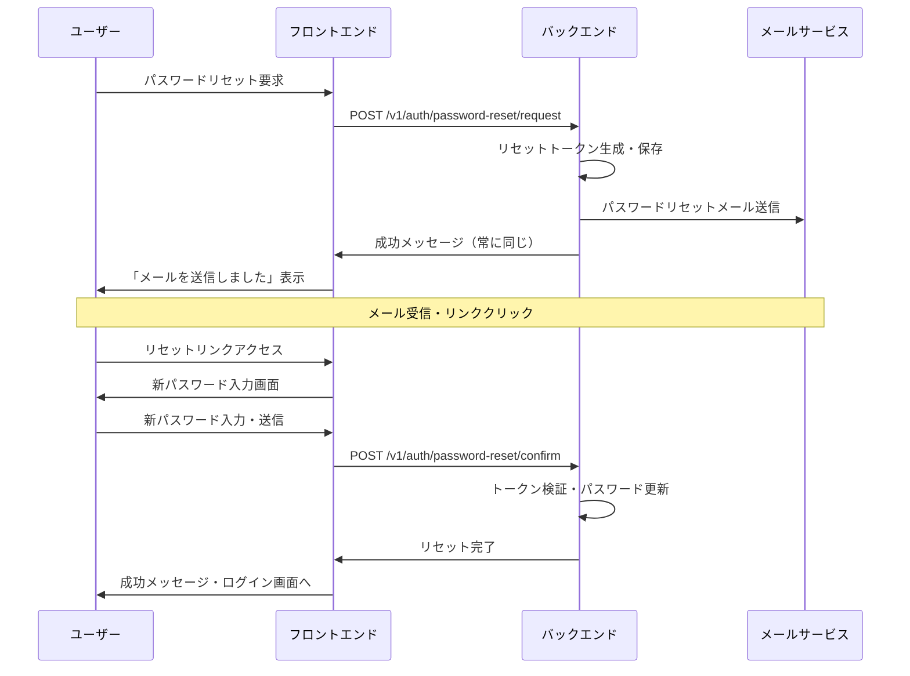

# パスワードリセット機能 仕様書

## 概要

Sleepy Capybara Chatのパスワードリセット機能の詳細仕様とセキュリティ対策について説明します。

## 基本仕様

### 1. パスワードリセット要求時の動作

**重要：既存パスワードは無効化されません**

- パスワードリセット要求を行っても、既存のパスワードは引き続き有効です
- ユーザーは以下の2つの方法でログインできます：
  1. **既存のパスワード**（リセット要求前と同じパスワード）
  2. **新しいパスワード**（リセット完了後に設定したパスワード）

### 2. パスワードリセットフロー



### 3. データベース状態の変化

#### リセット要求時

```sql
-- ユーザーレコードの状態
UPDATE users SET 
    reset_token = 'generated_token_here',
    reset_token_expires_at = '2024-01-01T15:00:00Z'  -- 1時間後
WHERE email = 'user@example.com';

-- 既存のhashed_passwordは変更されない
```

#### リセット完了時

```sql
-- パスワード更新とトークン無効化
UPDATE users SET 
    hashed_password = 'new_hashed_password',
    reset_token = NULL,
    reset_token_expires_at = NULL
WHERE reset_token = 'valid_token';
```

## セキュリティ仕様

### 1. ユーザー列挙攻撃の防止

**問題：** 攻撃者が有効なメールアドレスを特定できてしまう

**対策：** メールアドレスの存在に関わらず、常に同じレスポンスを返す

```python
# 安全な実装
return {
    "message": "If your email is registered, a password reset link has been sent."
}
```

**効果：**

- 存在しないメールアドレス → 同じメッセージ
- 存在するメールアドレス → 同じメッセージ
- 攻撃者は区別できない

### 2. トークンのセキュリティ

- **生成方法：** `secrets.token_urlsafe(32)` - 暗号学的に安全な乱数
- **有効期限：** 1時間（デフォルト）
- **一意性：** 各リセット要求で新しいトークンを生成
- **無効化：** リセット完了時に自動的に削除

### 3. レート制限

**実装済み：**

- 同一ユーザーからの連続要求を60秒間制限
- フロントエンドでクールダウンタイマー表示
- バックエンドでHTTP 429エラーレスポンス

**今後の改善点：**

- 同一IPアドレスからの要求制限

## ユーザー体験

### 正常なケース

1. **リセット要求**
   - ユーザーがメールアドレスを入力
   - 「メールを送信しました」メッセージ表示
   - メール受信（存在するアドレスの場合のみ）

2. **パスワード変更**
   - メールのリンクをクリック
   - 新しいパスワードを2回入力
   - 「パスワードリセット完了」メッセージ
   - ログイン画面へ自動リダイレクト

### エラーケース

1. **無効なリンク（ページアクセス時）**
   - 期限切れ、存在しない、または無効化されたトークン
   - 専用のエラーページを表示
   - 新しいリセット要求への誘導

2. **パスワード不一致**
   - 確認用パスワードが一致しない
   - フロントエンドでバリデーション

3. **リセット実行時のエラー**
   - トークンが途中で無効化された場合
   - 適切なエラーメッセージを表示

## API仕様

### パスワードリセット要求

```http
POST /v1/auth/password-reset/request
Content-Type: application/json

{
  "email": "user@example.com"
}
```

**レスポンス（常に同じ）：**

```json
{
  "message": "If your email is registered, a password reset link has been sent."
}
```

### トークン検証

```http
GET /v1/auth/password-reset/verify-token?token=reset_token_from_email
```

**成功レスポンス：**

```json
{
  "message": "Token is valid",
  "email": "user@example.com"
}
```

**エラーレスポンス：**

```json
{
  "detail": "Invalid or expired token"
}
```

### パスワードリセット実行

```http
POST /v1/auth/password-reset/confirm
Content-Type: application/json

{
  "token": "reset_token_from_email",
  "new_password": "new_secure_password"
}
```

**成功レスポンス：**

```json
{
  "message": "Password reset successful"
}
```

**エラーレスポンス：**

```json
{
  "detail": "Invalid or expired token"
}
```

## 運用上の注意点

### 1. メール送信の設定

- Gmail SMTP、SendGrid、またはMailHogが適切に設定されている必要があります
- メール送信エラーが発生してもユーザーには同じ成功メッセージを表示します

### 2. トークンの管理

- トークンは1時間で自動的に期限切れになります
- 使用済みトークンは自動的に削除されます
- **重要：同一ユーザーが複数回リセット要求した場合、最新のトークンのみが有効です**
  - 新しいリセット要求により、古いトークンは自動的に無効化されます
  - これにより古いメールのリンクは使用できなくなります

### 3. ログの監視

以下のログを監視することを推奨：

- パスワードリセット要求の頻度
- 無効なトークンでのアクセス試行
- メール送信エラー

## よくある質問

### Q: パスワードリセット要求後、古いパスワードでログインできますか？

**A: はい、できます。** パスワードリセット要求を行っても、既存のパスワードは無効化されません。新しいパスワードを設定するまで、古いパスワードでのログインが可能です。

### Q: リセットメールが届かない場合は？

**A:** 以下を確認してください：

1. メールアドレスが正しく登録されているか
2. スパムフォルダに入っていないか
3. メールサービスの設定が正しいか

### Q: トークンの有効期限は？

**A:** デフォルトで1時間です。期限切れの場合は再度リセット要求を行ってください。

### Q: 複数回リセット要求した場合は？

**A:** 最新のリセット要求のトークンのみが有効になります。古いトークンは自動的に無効化されます。ただし、連続要求は60秒間制限されます。

### Q: 短時間に何度もリセット要求できますか？

**A:** いいえ、セキュリティ対策として60秒間のレート制限があります。前回の要求から60秒経過後に再度要求可能になります。

## 更新履歴

- 2024-XX-XX: 初版作成
- パスワードリセット機能の基本仕様とセキュリティ対策を文書化
